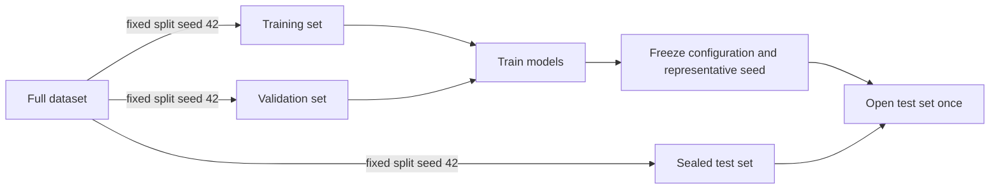

# Deep Learning Mastery Checkpoint

This checkpoint asks a practical question:

> Does a neural network earn its extra complexity on small 8×8 digit images?

The experiment compares four approaches on the bundled `sklearn` digits dataset:

1. a majority-class guess;
2. scaled logistic regression;
3. a multilayer perceptron (MLP);
4. a small convolutional neural network (CNN).

No API key or download is required.

## The experiment boundary



The split never changes when the model-training seed changes. This matters because
otherwise a “seed comparison” would mix together two effects: different initial
weights and different examples in each split.

The script automatically:

- compares MLP dropout `0.0` with `0.15`;
- compares a CNN with and without one-pixel shift augmentation;
- trains the chosen MLP and CNN configurations with seeds `11`, `22`, and `33`;
- reports mean, standard deviation, minimum, and maximum validation metrics;
- selects the run nearest the median validation log loss as the representative;
- evaluates the test set only after every choice is frozen;
- saves both models, the training-only scaler, metadata, and artifact hashes.

## Run it

```bash
make deep-learning-train
make deep-learning-test
```

Training writes these files to `artifacts/`:

| File | Meaning |
|---|---|
| `model.pt` | Representative MLP weights |
| `cnn_model.pt` | Representative CNN weights |
| `scaler.joblib` | Scaling statistics learned from training rows only |
| `metadata.json` | Configuration, histories, ablations, seed variation, metrics, and hashes |

The strongest model is not automatically the most appropriate model. Read
`selection.complexity_decision` in the metadata: the recommendation uses validation
evidence and requires a meaningful gain before accepting neural-network complexity.

Complete [MASTERY_CHECKPOINT.md](MASTERY_CHECKPOINT.md) after the automated tests pass.
